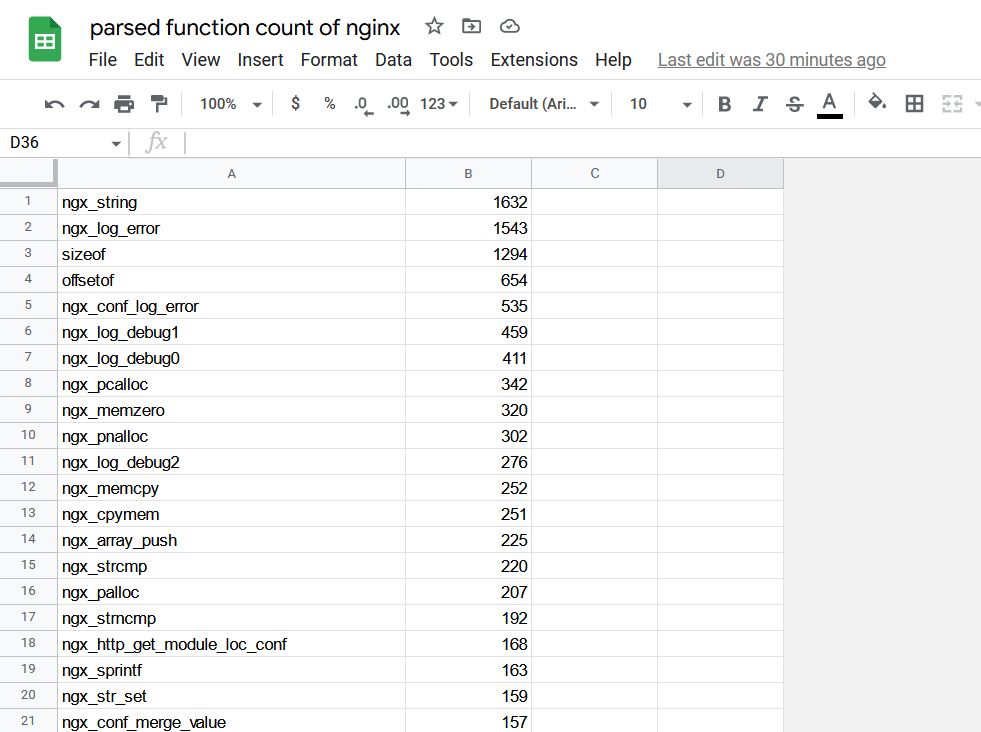

# Mangle v0.1

Tool for analyzing code base.

Currently implemented
- analyze function frequenczy and export to csv

<!---image --->

TODO:
- Could be used to determine that function names use the given standard
