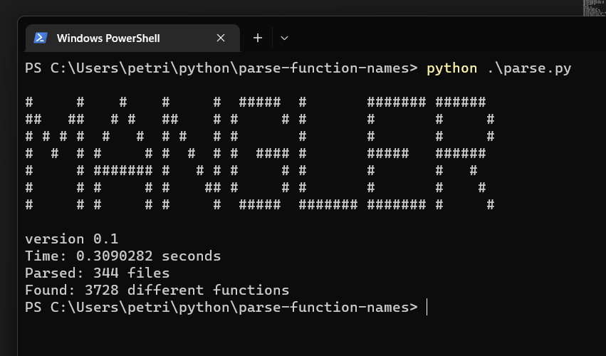
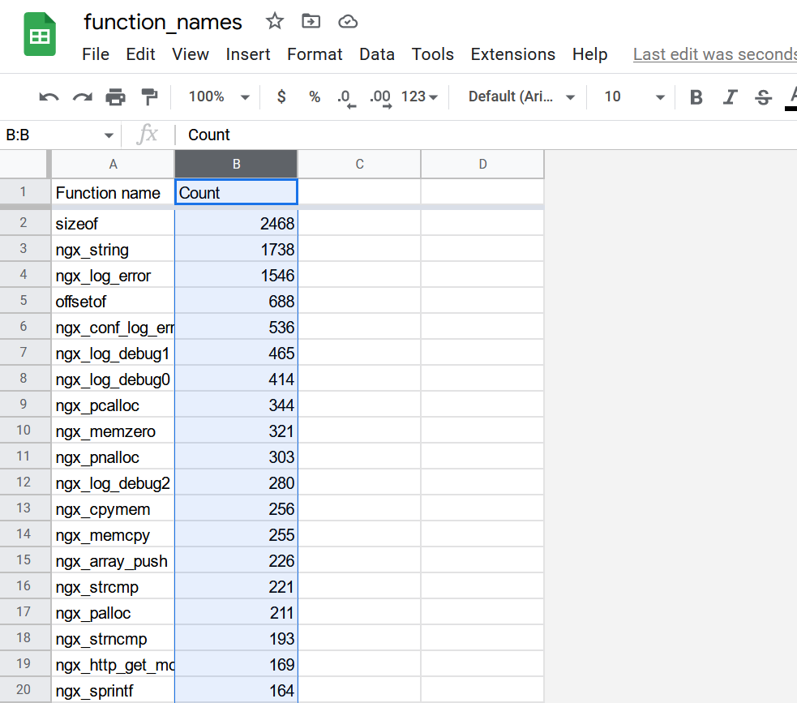

# Mangle v0.1

Tool for analyzing C codebase.

Currently implemented
- analyze function frequency and export to csv

<!---image --->

run against nginx [Link to google sheets](https://docs.google.com/spreadsheets/d/1crQyoxLpZhjzFrsiogF74hqWBomWeefxM4VVichnnK4/edit?usp=sharing)

# Things to condsider

Codebase will be a mess for now cos will be adding features before considerng how everyting should be organized.

## List of TODO in no particular order
1. Venv files for easy setup on a new system
1. Use [pycparser](https://pypi.org/project/pycparser/) tokenizer to get rid of brute force string parsing.
1. Check that function names use wanted convention.
1. Check that files use wanted convention.
1. Add [curses](https://docs.python.org/3/howto/curses.html) GUI.
    1. Possible visualisations.
1. Data storage module instead of csv files.
