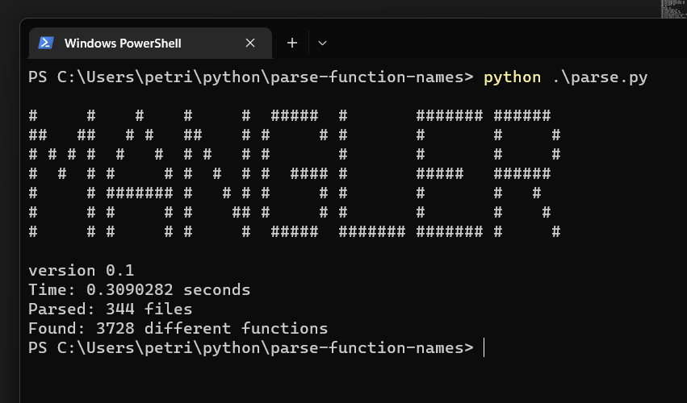

# Mangle v0.1

Tool for analyzing C codebase.

Currently implemented
- analyze function frequency and export to csv

<!---image --->

run against nginx [Link to google sheets](https://docs.google.com/spreadsheets/d/1crQyoxLpZhjzFrsiogF74hqWBomWeefxM4VVichnnK4/edit?usp=sharing)

TODO:
- Could be used to determine that function names use the given standard
